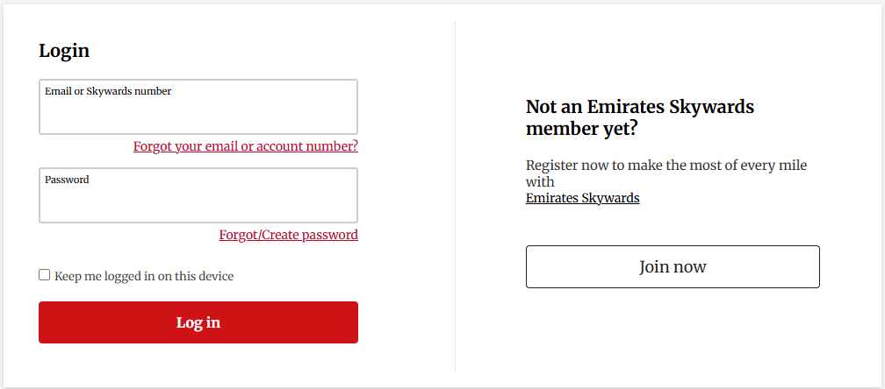

  # Web Form inspired by Emirates Airline

div>
### Short Description
The project involves creating web-based login and registration forms inspired by the design used by Emirates airline. The purpose of the assignment is to practice HTML, CSS, and basic JavaScript validation. The login form allows users to sign in with their email or Skywards number, while the registration form collects personal information from new users. Both forms use required fields and custom error messages to ensure correct input. The design focuses on a clean, professional layout that resembles real airline web interfaces.

---

---

### Purpose of the Project
- Practice HTML, CSS, and basic JavaScript validation

### Inspiration
- Emirates login and registration forms

### Login Form Features
- Sign in with email or Skywards number  
- Password field + “remember me” checkbox  
- Links for password recovery and account help  

### Registration Form Features
- Collection of essential user information  
- Optional newsletter subscriptions  
- Required fields + JavaScript error messages  

### Design Elements
- Clean, structured layout using divs and tables  
- CSS styling for a professional, airline-style appearance  

### Functionality
- Input validation for correct completion  
- User-friendly guidance and feedback  

### Goal
- Create realistic, functional forms similar to real airline websites  
- Demonstrate skills in structure, design, and validation of web forms  

---

### Successful login
**Email or Skywards number**: neki@g.c

**Password**: aaaa
